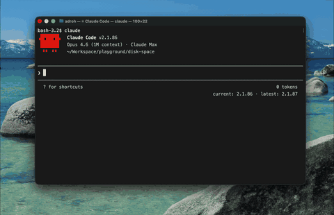

<div align="center">

<pre>
██╗    ██╗██╗  ██╗██╗███████╗██████╗ ██╗   ██╗
██║    ██║██║  ██║██║██╔════╝██╔══██╗╚██╗ ██╔╝
██║ █╗ ██║███████║██║███████╗██████╔╝ ╚████╔╝
██║███╗██║██╔══██║██║╚════██║██╔═══╝   ╚██╔╝
╚███╔███╔╝██║  ██║██║███████║██║        ██║
 ╚══╝╚══╝ ╚═╝  ╚═╝╚═╝╚══════╝╚═╝        ╚═╝
</pre>

**Push-to-talk speech → text, pasted at your cursor.**  
Free & open source — bring your own [OpenAI Whisper API](https://platform.openai.com/docs/guides/speech-to-text) key; no vendor lock-in, no subscription to *this* app.

[](LICENSE)

</div>

---

<p align="center">
  
</p>

## Why Whispy

Subscription dictation tools tax everyone for a thin client. Whispy is a **native macOS menu-bar app** you build and run yourself: you pay only for API usage you control.

## Features

- Global shortcut → record → transcribe → **paste** (clipboard + simulated ⌘V)
- **Menu bar tray** → **Preferences...** for API key, Whisper model, language, and shortcut
- `.app` install via `scripts/install.sh` (Launch Agent optional)

## Configuration

Open the **Whispy** icon in the **menu bar**, then choose **Preferences...**. Settings are written to `~/Library/Application Support/whispy/config.json` and picked up again when you close the window and before each recording.

## Requirements

- **macOS** (tested on recent versions)
- **Rust** toolchain (`rustup`)
- **Microphone** and **Accessibility** permissions (for global hotkey and paste)
- OpenAI API key with Whisper access

## Quick start

```bash
git clone https://github.com/ardroh/whispy.git
cd whispy
cargo run
```

On first launch, use the tray icon → **Preferences...** and add your API key. Default shortcut: `⌃ ⌘ ⇧ Space` (change it there).

**Release + `~/Applications/Whispy.app`:**

```bash
bash scripts/install.sh
```

Verbose logging: `RUST_LOG=info cargo run`.

## License

[MIT](LICENSE)
